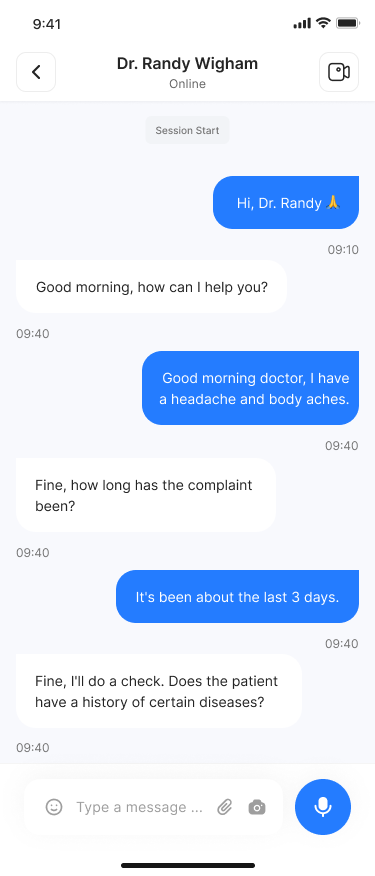
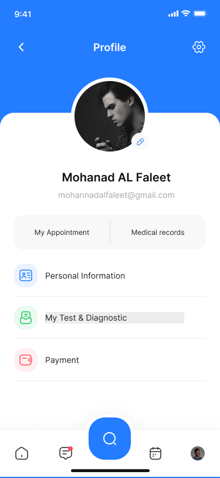
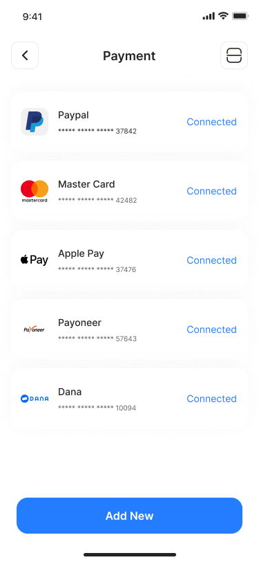

# Health_Care App
# A doctor appiontment project

### Screenshots:
<h1>
  Some ui/ux design from the project 
</h1>

  <h4>Auth</h4>
  
  
  
  <h4>Home</h4>
  
  <h4>Doctors</h4>
  
  
  <h4>Booking</h4>
  
  <h4>inbox</h4>
   
  <h4>Profile</h4>
   
   
   

A new Flutter project.
